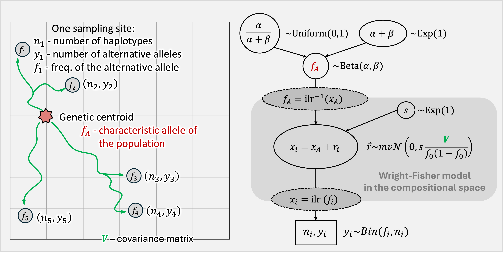

# popdisp

**pop**ulation **disp**ersals: method to estimate allele frequencies in a region considering geographical locations of sampling sites, the nonequal number of samples in locations, and, most crucially, possible ways of dispersals within a region. It utilizes hierarchical Bayesian Modeling, compositional nature of frequencies and the Wright-Fisher model of drift.

If you use **popdisp** in your work, please cite:
[Historical Routes for Diversification of Domesticated Chickpea Inferred from Landrace Genomics](https://doi.org/10.1093/molbev/msad110)  
*Anna A. Igolkina, Nina V. Noujdina, Margarita Vishnyakova, Travis Longcore, Eric von Wettberg, Sergey V. Nuzhdin, Maria G. Samsonova*  
**Molecular Biology and Evolution**, Volume 40, Issue 6, June 2023, msad110.  


## Bayesian model

The **popdisp** model is Bayesian, with the following structure:



- \( f_A \) — characteristic allele frequency of the population  
- \( n_i \) — number of haplotypes  
- \( y_i \) — number of alternative alleles  
- \( f_i \) — frequency of the alternative allele  
- \( V \) — covariance matrix  
- \( s \) — scale parameter  
- \( f_A = ilr^{-1}(x_A) \) — inverse isometric log-ratio transform  
- \( x_i = ilr(f_i) \) — isometric log-ratio transform  


## Input data

The **popdisp** model requires two main input components:

1. **Covariance matrix**  
   Defines relationships between sampling sites, based on hypothetical dispersal routes within the region.  

2. **Allele frequency data**  
   Provides observed allele counts and frequencies for each sampling location within the region.  

Both components must be provided together, as they jointly describe the geographic and genetic structure used by the model.

This repository includes the chickpea datasets used in the article mentioned above:  
- `data/cov_mx`  
- `data/samples`

## Quick Start

A typical workflow with **popdisp** consists of four main steps:  

```python
from popdisp import PopData, ClusterCov, HistOpt

# 1. Load allele frequency data
data = PopData(file_qdata, file_ndata)  
# file_qdata – allele frequencies by location
# file_ndata – number of haplotypes per location

# 2. Load covariance matrix
mx_cov = ClusterCov(file_cov)  
# file_cov – covariance matrix describing dispersal routes

# 3. Initialize the optimizer
opt_hist = HistOpt(mx_cov, data, ab_flag=True, ilr_flag=True)  
# ab_flag – use A/B parametrization
# ilr_flag – apply isometric log-ratio transform

# 4. Run the optimization
opt_hist.optimise(path_res, n_thr=30)  
# path_res – path to save the results
# n_thr – number of threads to use
```


## Pipeline (running the test)

To demonstrate the test, please run:
* `estim_routes.py` to get estimates of allele frequencies
* `get_stat.py` to get statisticks for MCMC


## Requirements

To run **popdisp** methods, you need Python 3.4 or later. A list of required Python packages that the **popdisp** depends on, are in `requirements.txt`.  


## Authors

Anna Igolkina developed the **popdisp** package, [e-mail](mailto:igolkinaanna11@gmail.com).    


## License information
The **popdisp** package is open-sourced software licensed under the [MIT license](https://opensource.org/licenses/MIT).


